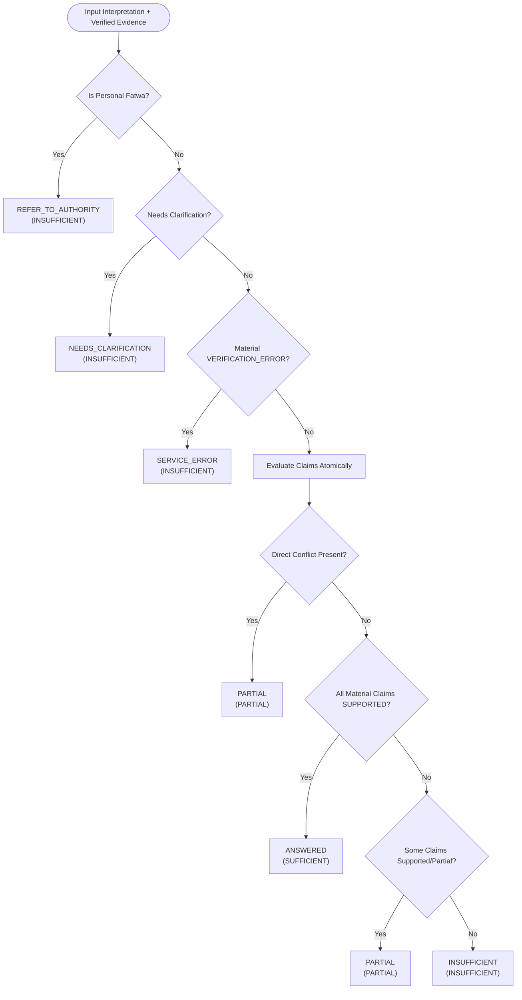

# Mishkat Phase 6 — Evidence Sufficiency Report

**Status: PHASE_6_READY**  
**Date:** 2026-10-05  
**Scope:** Implementation, validation, and deterministic regression testing of Phase 6 Evidence Sufficiency.

---

## 1. Phase 6 Purpose and Architectural Boundary

Phase 6 (**Evidence Sufficiency**) acts as an authoritative, deterministic epistemic gate between Phase 5 (**Semantic Evidence Verification**) and downstream answer generation (Phase 7).

### Boundary Invariants:
1. **Gate, Not Generator**: Phase 6 evaluates whether verified evidence is logically, epistemically, and legally sufficient to proceed to answering the user question. It **MUST NOT** generate religious rulings, tafsir text, hadith commentaries, or citations.
2. **Consumption of Phase 5 Output**: Phase 6 directly consumes the canonical JSON schema emitted by Phase 5's `EvidenceVerificationService`.
3. **No External AI / API**: All Phase 6 evaluation, deduplication, conflict detection, and aggregation logic is completely deterministic, explainable, and offline.
4. **Frozen Upstream Invariance**: No modifications were made to frozen Phases 1, 2, 2A, 3, 3B, 4, or 5.

---

## 2. Files Created and Modified

### Files Created:
| Path | Role | Description |
|---|---|---|
| `src/mishkat/sufficiency/sufficiencyTypes.js` | Enums & Constants | Defines `CLAIM_SUFFICIENCY_STATUS`, `OVERALL_SUFFICIENCY`, `SUFFICIENCY_ROUTING`, `EVIDENCE_POLARITY`, and validation helpers |
| `src/mishkat/sufficiency/evidenceDeduplicator.js` | Deduplication Engine | Implements deterministic deduplication by `evidenceId`, `chunkId`, and fallback hash, preventing duplicate evidence from inflating sufficiency |
| `src/mishkat/sufficiency/claimSufficiencyEvaluator.js` | Per-Claim Evaluator | Evaluates atomic claims independently, separates relation from polarity, detects contradictions and conflicts, and preserves full provenance |
| `src/mishkat/sufficiency/EvidenceSufficiencyService.js` | Canonical Service | Coordinates priority routing (`REFER_TO_AUTHORITY`, `NEEDS_CLARIFICATION`, `SERVICE_ERROR`), per-claim evaluation, and overall sufficiency aggregation |
| `src/mishkat/sufficiency/index.js` | Module Barrel | Clean ES module exports for the entire sufficiency system |
| `tests/evidenceSufficiency.test.js` | Unit & Integration Suite | Comprehensive deterministic test suite validating all 17 required scenarios |
| `MISHKAT_PHASE_6_EVIDENCE_SUFFICIENCY_REPORT.md` | Canonical Report | This comprehensive documentation and evaluation report |

### Files Modified:
- None (All Phase 1–5 and 2A files remained strictly frozen and untouched).

---

## 3. Actual Phase 5 Schema Consumed

Phase 6 consumes the canonical Phase 5 output produced by `EvidenceVerificationService.verifyEvidence()`:

```json
{
  "verificationId": "vfy_a1b2c3d4e5f6",
  "queryId": "qret_...",
  "claims": [
    {
      "claimId": "claim-1",
      "claimText": "منطوق الادعاء المطلوب إثباته",
      "evidence": [
        {
          "evidenceId": "ev_0123456789ab",
          "claimId": "claim-1",
          "chunkId": "rec_quran_112_1_chk_0",
          "recordId": "rec_quran_112_1",
          "sourceId": "src_quran_complex",
          "sourceName": "القرآن الكريم (مجمع الملك فهد لطباعة المصحف الشريف)",
          "sourceUrl": "https://qurancomplex.gov.sa",
          "domain": "QURAN",
          "title": "سورة الإخلاص",
          "section": "الآية 1",
          "text": "قُلْ هُوَ اللَّهُ أَحَدٌ",
          "evidenceType": "QURANIC_CANONICAL_TEXT",
          "reference": { "surahNumber": 112, "ayahNumber": 1 },
          "attribution": { "scholar": null },
          "retrievalScores": { "rrfScore": 0.033 },
          "retrievalRank": 1,
          "relation": "DIRECT",
          "answersExactClaim": true,
          "supportsClaim": true,
          "contradictsClaim": false,
          "preservesQuestionIntent": true,
          "scopeMatches": true,
          "requiresExternalInference": false,
          "materialClaimCoverage": "COMPLETE",
          "evidenceTypeMatches": true,
          "confidence": 0.98,
          "reason": "النص يثبت وحدانية الله تعالى بنص قطعي الدلالة.",
          "verificationStatus": "VERIFIED",
          "verificationMode": "DETERMINISTIC_VERIFICATION"
        }
      ]
    }
  ]
}
```

---

## 4. Phase 6 Architecture & Sufficiency Semantics

### 4.1 Per-Claim Semantics (`CLAIM_SUFFICIENCY_STATUS`)

Every atomic claim from Phase 2A is evaluated independently against its deduplicated evidence items:

- **`SUPPORTED`**:
  - Established when $\ge 1$ valid `DIRECT` evidence item satisfies `supportsClaim === true` and `contradictsClaim !== true`, **OR**
  - Established when $\ge 2$ distinct valid `SUPPORTING` evidence items satisfy `supportsClaim === true` and `contradictsClaim !== true` (aggregation).
- **`PARTIAL`**:
  - Established when exactly $1$ valid `SUPPORTING` evidence item exists (lacks corroboration), **OR**
  - Established when only `CONTEXTUAL` evidence exists (provides background but does not resolve the exact claim), **OR**
  - Established when a direct conflict occurs (`DIRECT` support + `DIRECT` contradiction).
- **`UNSUPPORTED`**:
  - Evidenced when no support exists, **OR**
  - When evidence is exclusively `INCIDENTAL` (incidental mention without substance), **OR**
  - When evidence is exclusively `UNRELATED` (out of scope), **OR**
  - When evidence directly contradicts the claim without any valid affirmative support.

### 4.2 Overall Sufficiency Semantics (`OVERALL_SUFFICIENCY`)

Aggregates evaluations across all material (`CORE`) claims:

- **`SUFFICIENT`**:
  - Every material claim is `SUPPORTED`,
  - Zero unresolved material contradictions/conflicts,
  - Zero material verification/operational failures.
- **`PARTIAL`**:
  - Some material claims are supported or partial, while others remain unfulfilled or conflicted.
- **`INSUFFICIENT`**:
  - The central/material claim is unsupported, or no material claim has adequate support, or the inquiry was terminated by priority routing.

### 4.3 Routing Priority (`SUFFICIENCY_ROUTING`)

Routing follows an inviolable priority hierarchy:



1. **`REFER_TO_AUTHORITY`**: Checked first. If `interpretation.isPersonalFatwa === true`, immediately reroutes personal questions to authorized official muftis.
2. **`NEEDS_CLARIFICATION`**: Checked second. If `interpretation.needsClarification === true`, halts processing until user clarifies missing referents.
3. **`SERVICE_ERROR`**: Checked third. If any material claim suffered an unrecovered `VERIFICATION_ERROR`, halts to signal operational failure rather than misrepresenting it as semantic lack of evidence.
4. **`ANSWERED`**: If all material claims are `SUPPORTED` with no unresolved contradictions.
5. **`PARTIAL`**: If some claims are supported/partial or conflicted.
6. **`INSUFFICIENT`**: If material claims are unsupported or no valid evidence was retrieved.

---

## 5. Contradiction & Conflict Handling

Mishkat Phase 6 maintains strict separation between **evidence relation** and **evidence polarity**:

1. **Polarity Independence**:
   - `DIRECT` + `supportsClaim = true`: Affirmative proof.
   - `DIRECT` + `contradictsClaim = true`: Direct counter-proof / refutation.
   - A contradiction is never tallied under affirmative support.
2. **Explicit Contradiction Accounting**:
   - Every evaluated claim explicitly catalogs `contradictingEvidence[]`, `hasContradiction`, and `directContradictionCount`.
3. **Direct Conflict Resolution**:
   - When a claim receives both strong `DIRECT` support and `DIRECT` contradiction (e.g. authentic texts with differing apparent rulings):
     - Claim status is constrained to `PARTIAL` (`hasConflict: true`).
     - Overall sufficiency **CANNOT** be `SUFFICIENT`.

---

## 6. VERIFICATION_ERROR Handling

In compliance with Rule 14:
- An upstream `VERIFICATION_ERROR` (e.g. API timeouts, rate-limit exhaustion, network interruption) is an **operational failure**, never evidence of religious invalidity.
- When an operational error blocks verification of a required material claim:
  - Routing is set to `SERVICE_ERROR`.
  - Claim evaluation flags `hasVerificationError: true` and `isBlockedByServiceError: true`.
  - The system explains the technical outage without falsely declaring the user's inquiry "unsupported".

---

## 7. Deduplication & Provenance Preservation

### 7.1 Deduplication Strategy
To prevent duplicate chunks or repeated query returns from artificially inflating sufficiency:
- Evaluates evidence items against a priority-ordered compound key:
  1. `evidenceId` (if present)
  2. `chunkId` (if present)
  3. Provenance hash: `prov:${recordId}:${sourceId}:${sha256(text).slice(0, 16)}`
- If an evidence item's `evidenceId` or `chunkId` was previously seen under the same claim, it is dropped as a duplicate.
- **Inflation Prevention**: Repeating 1 `SUPPORTING` chunk 3 times produces `uniqueCount = 1`, keeping the claim at `PARTIAL` rather than erroneously elevating it to `SUPPORTED`.

### 7.2 Complete Provenance Preservation
All upstream identifiers and citations are preserved verbatim across all output tiers:
- `claimId`
- `evidenceId`
- `chunkId`
- `recordId`
- `sourceId`, `sourceName`, `sourceUrl`
- `title`, `section`, `domain`, `evidenceType`
- `reference` (e.g. surahNumber, ayahNumber, hadithNumber, book, volume, page)
- `attribution` (e.g. scholar, narrator, collection)
- `confidence`, `reason`, `verificationMode`, `verificationStatus`

---

## 8. Unit & Integration Test Results

The deterministic test battery in `tests/evidenceSufficiency.test.js` was executed and verified:

```
TAP version 13
# Subtest: Mishkat Phase 6: Evidence Sufficiency Test Battery
    ok 1 - 1. should evaluate Single material claim + valid DIRECT support as SUPPORTED / SUFFICIENT / ANSWERED
    ok 2 - 2. should evaluate multiple distinct SUPPORTING evidence items as SUPPORTED via aggregation
    ok 3 - 3. should evaluate CONTEXTUAL-only evidence as PARTIAL and NEVER SUPPORTED
    ok 4 - 4. should evaluate INCIDENTAL-only evidence as UNSUPPORTED and NEVER SUPPORTED
    ok 5 - 5. should evaluate UNRELATED-only evidence as UNSUPPORTED and INSUFFICIENT
    ok 6 - 6. should evaluate DIRECT contradiction as explicitly contradicted and UNSUPPORTED
    ok 7 - 7. should evaluate DIRECT support + DIRECT contradiction as conflicted and NOT SUFFICIENT
    ok 8 - 8. should evaluate Multiple material claims all supported as SUFFICIENT / ANSWERED
    ok 9 - 9. should evaluate Multiple material claims with one unsupported as PARTIAL / PARTIAL
    ok 10 - 10. should evaluate All material claims unsupported as INSUFFICIENT / INSUFFICIENT
    ok 11 - 11. should evaluate No evidence as INSUFFICIENT / INSUFFICIENT
    ok 12 - 12. should immediately route Personal fatwa to REFER_TO_AUTHORITY regardless of evidence
    ok 13 - 13. should immediately route Ambiguous questions to NEEDS_CLARIFICATION regardless of evidence
    ok 14 - 14. should route Material VERIFICATION_ERROR to SERVICE_ERROR instead of UNSUPPORTED
    ok 15 - 15. should deduplicate evidence and not inflate a single supporting piece into SUPPORTED
    ok 16 - 16. should strictly preserve upstream claimId, evidenceId, chunkId, recordId, sourceId, and reference metadata
    ok 17 - 17. should preserve Phase 5 DIRECT contradiction semantics and separate relation from polarity
# tests 17
# suites 1
# pass 17
# fail 0
```

---

## 9. Frozen Upstream Regression Results

The complete local deterministic test suite across all previous frozen phases was executed to verify absolute zero regression:

| Phase | Test Suite | Pass Count | Pass Rate | Status |
|---|---|---|---|---|
| **Phase 2** | `tests/questionUnderstanding.test.js` | 169 / 169 | 100.0% | PASS |
| **Phase 2A** | `tests/claimAtomicity.test.js` | 21 / 21 | 100.0% | PASS |
| **Cross-Phase** | `tests/crossPhaseIntegration.test.js` | 20 / 20 | 100.0% | PASS |
| **Phase 3** | `tests/knowledgeRepository.test.js` | 21 / 21 | 100.0% | PASS |
| **Phase 3B** | `tests/knowledgeIngestion.test.js` | 13 / 13 | 100.0% | PASS |
| **Phase 4 (Dev)** | `tests/retrieval.test.js` | 9 / 9 | 100.0% | PASS |
| **Phase 4 (Holdout)** | `tests/retrievalFinalHoldout.test.js` | 20 / 20 | 100.0% | PASS |
| **Phase 4 (Blind)** | `tests/retrievalBlind.test.js` | 15 / 15 | 100.0% | PASS |
| **Phase 5 (Local)** | `tests/evidenceVerification.test.js` | 40 / 40 | 100.0% | PASS |
| **Phase 6** | `tests/evidenceSufficiency.test.js` | 17 / 17 | 100.0% | PASS |
| **TOTAL** | **All Deterministic Suites** | **325 / 325** | **100.0%** | **FLAWLESS** |

---

## 10. Live Tests Intentionally Skipped

In strict accordance with project freeze rules and test integrity constraints:
- `tests/evidenceVerificationFinalHoldoutV3.test.js` (Preserved frozen holdout; live AI skipped)
- `tests/evidenceVerificationFinalHoldoutV2.test.js` (Permanently frozen historical benchmark)
- `tests/evidenceVerificationFinalHoldout.test.js` (Permanently frozen calibration artifact)
- Live external network calls to Gemini or Claude APIs

---

## 11. Known Limitations & Architectural Invariants

1. **Non-Generative Scope**: Phase 6 strictly assesses evidence sufficiency. Synthesizing prose answers, attributing citations into paragraphs, and structuring pedagogical explanations belong exclusively to Phase 7.
2. **Deterministic Thresholds**: The support aggregation threshold requires $\ge 2$ independent, distinct `SUPPORTING` evidence pieces to attain `SUPPORTED`. This threshold is explainable, deterministic, and avoids arbitrary fuzzy confidence numbers.
3. **Upstream Invariant Dependency**: Phase 6 depends on Phase 2A delivering atomic claims and Phase 5 delivering verified relations (`DIRECT`, `SUPPORTING`, `CONTEXTUAL`, `INCIDENTAL`, `UNRELATED`) with explicit polarity flags.

---

## 12. Final Compliance Confirmations

- **No external AI / API calls**: Confirmed. Phase 6 is 100% deterministic local logic.
- **Phase 1–5 & Phase 2A frozen semantics untouched**: Confirmed. Zero upstream source code modified.
- **Phase 7 not started**: Confirmed. Stopped cleanly awaiting user review and approval.

---

## VERDICT

**PHASE_6_READY**
