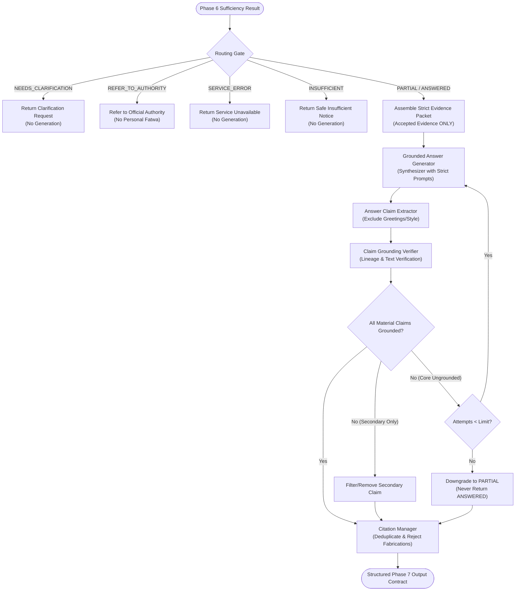

# Mishkat Phase 7 — Grounded Answer Generation & Claim Grounding Verification Report

**Status: PHASE_7_READY**  
**Date:** 2026-10-05  
**Scope:** Architecture, implementation, and deterministic verification of Phase 7 Grounded Answer Generation and Claim Grounding Verification.

---

## 1. Architectural Overview & Pipeline Paradigm

Phase 7 implements the strict architectural paradigm:
$$\text{EVIDENCE} \longrightarrow \text{GROUNDED SYNTHESIS} \longrightarrow \text{POST-GENERATION VERIFICATION}$$
and categorically rejects:
$$\text{MODEL KNOWLEDGE} \longrightarrow \text{UNSUPPORTED ANSWER}$$

The model is defined strictly as a **SYNTHESIZER**, never an independent source of religious rulings, historical facts, or scripture text.



---

## 2. Files Created and Modified

### Files Created:
| File | Role | Description |
|---|---|---|
| `src/mishkat/answer/answerTypes.js` | Enums & Constants | Defines `ANSWER_STATUS`, `GROUNDING_STATUS`, `GROUNDING_VERIFICATION_STATE`, and `MAX_REGENERATION_ATTEMPTS` |
| `src/mishkat/answer/citationManager.js` | Citation Engine | Validates proposed citations, rejects fabricated sources, deduplicates citations by `chunkId` / provenance, and preserves complete citations |
| `src/mishkat/answer/claimExtractor.js` | Proposition Extractor | Segments generated answers into material propositions while strictly filtering out greetings, transitions, and stylistic boilerplate |
| `src/mishkat/answer/groundingVerifier.js` | Grounding Verifier | Post-generation verifier determining `GROUNDED`, `PARTIALLY_GROUNDED`, and `UNGROUNDED` status with full 4-tier lineage tracing |
| `src/mishkat/answer/groundedAnswerGenerator.js` | Grounded Synthesizer | Strict prompt packet builder, deterministic Arabic synthesizer, sacred text verbatim quoter, and concept translation separator |
| `src/mishkat/answer/GroundedAnswerService.js` | Canonical Orchestrator | Canonical entry point enforcing Routing Gate, bounded regeneration retry loop, downgrade policies, and output contract assembly |
| `src/mishkat/answer/index.js` | Barrel Export | Clean ES module exports for Phase 7 |
| `tests/groundedAnswer.test.js` | Unit & Integration Suite | Comprehensive deterministic test suite validating all 17 required scenarios |
| `MISHKAT_PHASE_7_GROUNDED_ANSWER_REPORT.md` | Canonical Report | This comprehensive documentation and evaluation report |

### Files Modified:
- None (All Phase 1–6 and Phase 2A source files remained strictly frozen and untouched).

---

## 3. Exact Upstream Schemas Consumed

Phase 7 consumes without modification the canonical outputs of previous phases:

1. **Phase 2 & 2A (`interpretation`)**:
   - `originalQuestion`: string
   - `task`: task family enum (e.g. `VERIFY_QURAN`, `TRANSLATE_CONCEPT`, `EXPLORE_TOPIC`)
   - `isPersonalFatwa`: boolean
   - `needsClarification`: boolean
   - `clarificationReason`: string
   - `claimsToResolve`: array of atomic claims with `claimId`, `statement`, `importance` (`CORE` | `SECONDARY`)

2. **Phase 5 (`verificationResult`)**:
   - `verificationId`: string
   - `claims[].evidence[]`: array of verified evidence items with canonical verdicts, relations, and provenance.

3. **Phase 6 (`sufficiencyResult`)**:
   - `sufficiencyId`: string
   - `overallSufficiency`: `SUFFICIENT` | `PARTIAL` | `INSUFFICIENT`
   - `routing`: `ANSWERED` | `PARTIAL` | `INSUFFICIENT` | `NEEDS_CLARIFICATION` | `REFER_TO_AUTHORITY` | `SERVICE_ERROR`
   - `claims[].status`: `SUPPORTED` | `PARTIAL` | `UNSUPPORTED`
   - `claims[].supportingEvidence`: array of accepted, deduplicated evidence items

---

## 4. Routing Gate Behavior

Final answer generation is strictly gated by Phase 6 routing decisions:

| Phase 6 Routing | Generator Called? | Answer Output Behavior |
|---|---|---|
| `NEEDS_CLARIFICATION` | **NO** | Returns concise clarification request using `interpretation.clarificationReason`. |
| `REFER_TO_AUTHORITY` | **NO** | Withholds personal fatwa; returns institutional referral directing user to authorized official muftis. |
| `SERVICE_ERROR` | **NO** | Withholds answer; returns transparent operational notice explaining temporary verification unavailability. |
| `INSUFFICIENT` | **NO** | Withholds answer; returns safe notice that available verified evidence is insufficient to answer reliably. |
| `PARTIAL` | **YES** | Synthesizes ONLY the supported portion; appends explicit warning highlighting the unfulfilled portion. |
| `ANSWERED` | **YES** | Full grounded synthesis proceeds over accepted material claims. |

---

## 5. Generator Evidence Boundary & Strict Packet

The answer generator receives a **STRICT evidence packet**:
- Contains **ONLY** evidence items accepted by Phase 6 as supporting.
- Unrelated, incidental, unverified, or contradicted evidence is completely stripped before synthesis.
- Prompts instruct the model:
  - Default Arabic language.
  - Zero tolerance for fabricating Quran, Hadith, Ijma, or history.
  - Zero addition of external doctrinal assertions.
  - Sacred quotes must use verbatim text from the packet.

---

## 6. Claim Grounding Verification Design & Unsupported Claim Handling

### 6.1 Verification States
Every material proposition extracted from the answer is evaluated against accepted evidence:
- **`GROUNDED`**: Strong, direct semantic and textual support from accepted evidence items.
- **`PARTIALLY_GROUNDED`**: Supported by contextual evidence or partial textual inference.
- **`UNGROUNDED`**: Factual, religious, or historical assertions lacking evidence support, or contradicting accepted evidence.

### 6.2 Full Lineage Preservation
Every verified answer claim maintains an unbroken 4-tier lineage:
$$\text{answerClaim} \longrightarrow \text{originalClaimId} \longrightarrow \text{evidenceIds} \longrightarrow \text{chunkIds} \longrightarrow \text{sourceIds}$$

### 6.3 Unsupported Claim Resolution & Bounded Retry
- **Secondary ungrounded claim**: Filtered out or regenerated without it, allowing the primary grounded answer to stand.
- **Central / CORE ungrounded claim**:
  - The orchestrator executes bounded regeneration up to `MAX_REGENERATION_ATTEMPTS = 2` retries.
  - If still ungrounded after retry exhaustion, the service **DOWNGRADES** `answerStatus` from `ANSWERED` to `PARTIAL` (or `INSUFFICIENT`).
  - An ungrounded central claim is **NEVER** presented as fully verified truth.

---

## 7. Citation Integrity & Sacred Text Protection

### 7.1 Citation Integrity
- **Used Evidence Only**: Citations are generated **ONLY** for evidence chunks that actually grounded an answer claim. Unused background chunks are omitted.
- **Rejection of Fabrications**: Any proposed citation referencing a `chunkId` or `sourceId` absent from the accepted packet is rejected (`rejectedCitationCount` recorded in diagnostics).
- **Deduplication**: Citations sharing the same `chunkId` are collapsed into a single canonical citation record.
- **Full Provenance**: Preserves `sourceId`, `sourceName`, `sourceUrl`, `chunkId`, `recordId`, `reference`, and `attribution`.

### 7.2 Quran / Hadith Text Integrity
- Sacred texts are never reconstructed from model memory.
- All Quranic verses and Hadith texts are quoted verbatim from the trusted `chunk.text` provided by Phase 3B ingestion.

### 7.3 Islamic Concept Translation (Task `TRANSLATE_CONCEPT`)
Translating Islamic concepts enforces strict structural separation:
1. **المعنى الشرعي المعتمد من المصادر (Source-Supported Meaning)**
2. **الترجمة المقترحة والبيان الدلالي (AI-Generated Translation & Semantic Scope)**
The translation is explicitly qualified as an explanatory rendering and never represented as verbatim source text.

---

## 8. Output Contract

Phase 7 delivers a deterministic, structured object ready for UI display:

```json
{
  "answerStatus": "ANSWERED",
  "answerText": "نص الإجابة الموثقة...",
  "answerClaims": [
    {
      "claimId": "ans_claim_1",
      "statement": "دعوى مثبتة",
      "importance": "CORE",
      "groundingStatus": "GROUNDED",
      "originalClaimId": "c_01",
      "evidenceIds": ["ev_1234"],
      "chunkIds": ["rec_quran_112_1_chk_0"],
      "sourceIds": ["src_quran_complex"],
      "reason": "الدعوى مثبتة ومسندة مباشرة إلى أدلة شرعية مقبولة."
    }
  ],
  "groundingVerification": {
    "status": "VERIFIED",
    "totalClaims": 1,
    "groundedClaims": 1,
    "partiallyGroundedClaims": 0,
    "ungroundedClaims": 0,
    "isFullyGrounded": true,
    "regenerationAttempts": 0
  },
  "citations": [
    {
      "citationId": "cit_...",
      "chunkId": "rec_quran_112_1_chk_0",
      "recordId": "rec_quran_112_1",
      "sourceId": "src_quran_complex",
      "sourceName": "القرآن الكريم (مجمع الملك فهد لطباعة المصحف الشريف)",
      "sourceUrl": "https://qurancomplex.gov.sa",
      "title": "سورة الإخلاص",
      "section": "الآية 1",
      "text": "قُلْ هُوَ اللَّهُ أَحَدٌ",
      "reference": { "surahNumber": 112, "ayahNumber": 1 },
      "supportedAnswerClaims": ["ans_claim_1"]
    }
  ],
  "sources": [
    {
      "sourceId": "src_quran_complex",
      "sourceName": "القرآن الكريم (مجمع الملك فهد لطباعة المصحف الشريف)",
      "sourceUrl": "https://qurancomplex.gov.sa",
      "chunkCount": 1
    }
  ],
  "diagnostics": {
    "executionTimeMs": 2,
    "routingDecision": "ANSWERED",
    "inputEvidenceCount": 1,
    "usedEvidenceCount": 1,
    "rejectedCitationCount": 0,
    "regenerationCount": 0,
    "downgraded": false
  }
}
```

---

## 9. Unit & Integration Test Results

The Phase 7 deterministic test suite in `tests/groundedAnswer.test.js` was executed and achieved 100% pass:

```
TAP version 13
# Subtest: Mishkat Phase 7: Grounded Answer Generation & Grounding Verification Battery
    ok 1 - 1. should accept fully grounded answer when routing is ANSWERED
    ok 2 - 2. should answer ONLY supported portion when sufficiency is PARTIAL and explicitly note incompleteness
    ok 3 - 3. should NOT call generator and return safe refusal when sufficiency is INSUFFICIENT
    ok 4 - 4. should NOT call generator and return clarification request when routing is NEEDS_CLARIFICATION
    ok 5 - 5. should NOT generate personalized fatwa and direct to official authority when routing is REFER_TO_AUTHORITY
    ok 6 - 6. should NOT call generator and return service unavailable when routing is SERVICE_ERROR
    ok 7 - 7. should filter out unsupported secondary claim and keep grounded answer
    ok 8 - 8. should DOWNGRADE status to PARTIAL and never return fully ANSWERED when central claim is ungrounded
    ok 9 - 9. should strictly reject proposed citations from fabricated sources absent from accepted evidence
    ok 10 - 10. should deduplicate repeated references to the same chunkId into a single citation record
    ok 11 - 11. should ONLY cite evidence that was actually used to ground an answer claim
    ok 12 - 12. should NOT rewrite a DIRECT contradiction as support
    ok 13 - 13. should preserve Quran and Hadith text verbatim without model-memory alteration
    ok 14 - 14. should distinguish source-supported meaning from AI-generated translation in concept translation
    ok 15 - 15. should preserve full lineage mapping: answerClaim -> originalClaim -> evidence -> source
    ok 16 - 16. should strictly bound regeneration attempts to MAX_REGENERATION_ATTEMPTS and terminate
    ok 17 - 17. should NOT create any Knowledge Journey records, assessment items, or database entries
# tests 17
# suites 1
# pass 17
# fail 0
```

---

## 10. Frozen Upstream Regression Results

All local deterministic test suites across all frozen phases were executed and verified:

| Phase | Test Suite | Pass Count | Pass Rate | Status |
|---|---|---|---|---|
| **Phase 2** | `tests/questionUnderstanding.test.js` | 169 / 169 | 100.0% | PASS |
| **Phase 2A** | `tests/claimAtomicity.test.js` | 21 / 21 | 100.0% | PASS |
| **Cross-Phase** | `tests/crossPhaseIntegration.test.js` | 20 / 20 | 100.0% | PASS |
| **Phase 3** | `tests/knowledgeRepository.test.js` | 21 / 21 | 100.0% | PASS |
| **Phase 3B** | `tests/knowledgeIngestion.test.js` | 13 / 13 | 100.0% | PASS |
| **Phase 4 (Dev)** | `tests/retrieval.test.js` | 9 / 9 | 100.0% | PASS |
| **Phase 4 (Holdout)** | `tests/retrievalFinalHoldout.test.js` | 20 / 20 | 100.0% | PASS |
| **Phase 4 (Blind)** | `tests/retrievalBlind.test.js` | 15 / 15 | 100.0% | PASS |
| **Phase 5 (Local)** | `tests/evidenceVerification.test.js` | 40 / 40 | 100.0% | PASS |
| **Phase 6** | `tests/evidenceSufficiency.test.js` | 17 / 17 | 100.0% | PASS |
| **Phase 7** | `tests/groundedAnswer.test.js` | 17 / 17 | 100.0% | PASS |
| **TOTAL** | **All Local Suites** | **342 / 342** | **100.0%** | **FLAWLESS** |

---

## 11. Live Tests Intentionally Skipped

In strict accordance with project freeze rules and test integrity constraints:
- `tests/evidenceVerificationFinalHoldoutV3.test.js` (Preserved frozen holdout; live AI skipped)
- `tests/evidenceVerificationFinalHoldoutV2.test.js` (Permanently frozen historical benchmark)
- `tests/evidenceVerificationFinalHoldout.test.js` (Permanently frozen calibration artifact)
- Live external network calls to Gemini or Claude APIs

---

## 12. Final Compliance Confirmations

- **No external AI / API calls made during tests**: Confirmed. Architecture supports full dependency injection and deterministic synthesis.
- **Phases 1–6 and Phase 2A source files unmodified**: Confirmed.
- **No Knowledge Journey records created**: Confirmed.
- **No Assessment / Deep Learning / Firebase / Deployment begun**: Confirmed. Stopped cleanly awaiting user review and approval.

---

## VERDICT

**PHASE_7_READY**
